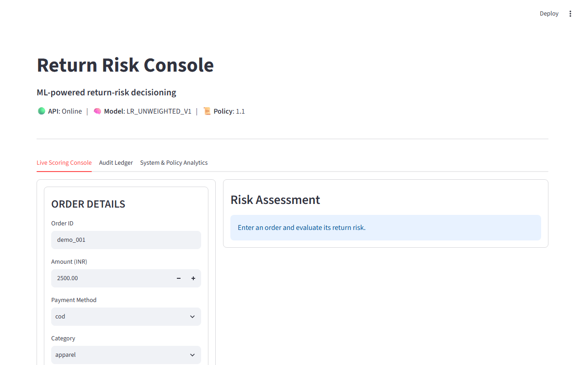
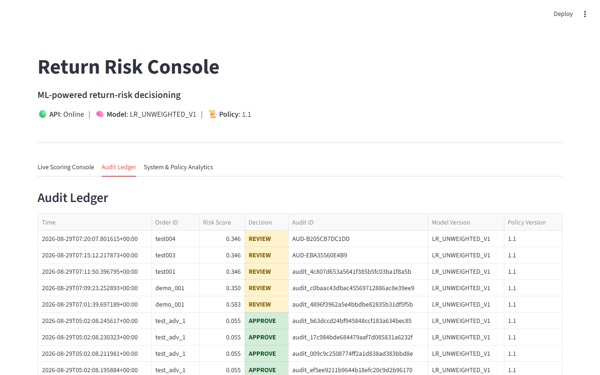
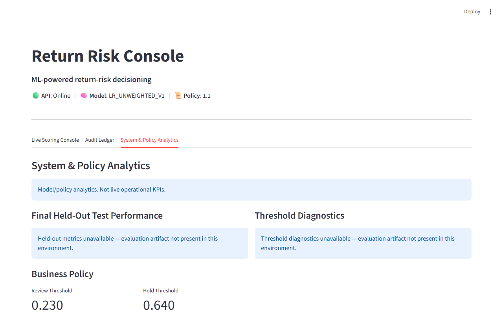
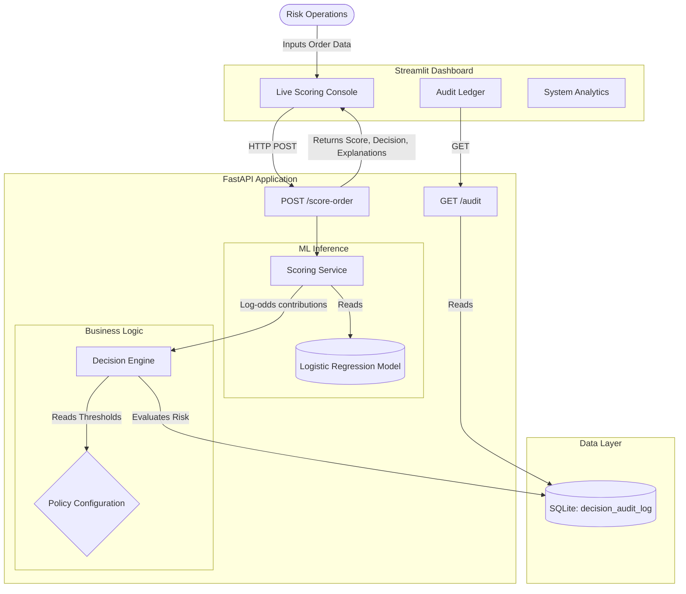

# Razorpay Return Risk Scorer

**AI-assisted return / chargeback risk decisioning for e-commerce orders**

> **IMPORTANT DISCLAIMER**
> This is a defense-only evaluation system trained on synthetic transaction data using hypothetical business-cost assumptions. It does **not** reflect real Razorpay production performance, nor does it contain real Razorpay transaction data or official cost thresholds. 

## Problem

E-commerce merchants face significant financial losses from returned orders (RTO - Return to Origin) and fraudulent chargebacks. 

Given an order at scoring time, this system estimates its return/chargeback risk and translates that mathematical signal into an operational action:
* **APPROVE**: Low risk; proceed without friction.
* **REVIEW**: Moderate risk; route to a human operations team for manual verification.
* **HOLD**: High risk; pause fulfillment pending escalated resolution.

The system is designed around risk ranking, operational review capacity, economic trade-offs, and transparent auditability. It does not autonomously block payments, but rather provides defense-in-depth decision support.

## Why this approach

This project emphasizes an evidence-driven, economically-aware ML methodology rather than raw model complexity:
* **Logistic Regression:** Transparent, inherently interpretable, and computationally efficient.
* **Calibration Evaluation:** Probabilities are evaluated for real-world calibration to ensure risk percentages are meaningful.
* **Cost-Aware Policy Selection:** Thresholds are mathematically optimized against simulated review costs and capacity constraints.
* **Bounded Decisions:** The model outputs an actionable `APPROVE / REVIEW / HOLD` decision, not just a floating-point number.
* **Model-Derived Explanations:** Real mathematical feature contributions (log-odds) are surfaced to assist human review.
* **Audit History:** An application-level append-only SQLite database ensures all decisions are durably recorded.

## Dashboard Preview

**Live Scoring Console (Risk Assessment & Explainability)**


**Audit Ledger & Decision Receipts**


**System & Policy Analytics**


## Architecture



For deep technical details on component boundaries and data flows, see [ARCHITECTURE.md](ARCHITECTURE.md). For detailed model methodology, see [MODEL_CARD.md](MODEL_CARD.md).

## Quick Start

### Environment
```bash
python -m venv .venv
# Activate: source .venv/bin/activate (Linux/Mac) or .venv\Scripts\activate (Windows)
pip install -r requirements.txt
```

### Reproduce from scratch
```bash
python src/generate_data.py --n 5000 --seed 42
python src/policy_selection.py
python src/train.py
```

### Run the Application
**Backend (FastAPI):**
```bash
uvicorn api:app --app-dir src --host 127.0.0.1 --port 8000
```
**Frontend (Streamlit):**
```bash
streamlit run dashboard/app.py
```

### Tests
Run the comprehensive test suite to verify the decision engine, API, and policy isolation:
```bash
python -m pytest tests -q
```
*Current verified test result: 66 passed, 274 warnings*

## Demo Walkthrough

A complete system evaluation takes approximately 2-3 minutes:
1. Open the Streamlit dashboard (`http://localhost:8501`).
2. Check the top header to verify the overall System Health is `Online`.
3. In the **Live Scoring Console** tab, enter a high-value COD order and click **Score Order**.
4. Observe the calculated Risk Score, the categorical **APPROVE/REVIEW/HOLD** decision, and the visual threshold evaluation.
5. Review the **Risk Increasing Factors** and **Risk Reducing Factors** to see exactly which features drove the decision.
6. Copy the generated Audit ID from the success confirmation.
7. Navigate to the **Audit Ledger** tab.
8. Verify the decision was recorded, and select the Audit ID to view a structured **Audit Receipt** containing the core decision and available explanations.
9. Open the **System & Policy Analytics** tab to view the threshold trade-off curves and held-out test metrics.

## Current Model and Evaluation

* **Model:** Logistic Regression
* **Model version:** `LR_UNWEIGHTED_V1`

### Final Held-Out Test Metrics
* **Test ROC-AUC:** 0.759
* **Test Average Precision:** 0.404

### Validation Diagnostics
* **Validation Brier Score:** 0.1218
* **Validation prevalence:** 0.1638
* **Validation naive Brier baseline:** 0.1369

*(Note: Brier Score is a validation diagnostic used during policy selection, not a held-out test metric).*

## Frozen Policy

The decision thresholds were optimized on an **internal validation split** to minimize simulated operational costs, preventing test-set leakage. The current hypothetical assumptions are:

* **Review threshold:** 0.20
* **Hold threshold:** 0.79
* **Review cost assumption:** ₹50
* **Hold cost assumption:** ₹150
* **Review residual-risk assumption:** 10%
* **Maximum intervention rate:** 25%
* **Maximum hold rate:** 5%

## Final Held-Out Policy Behavior

When the frozen policy is applied to the unseen synthetic test set under the stated assumptions, it yields:
* **Approval rate:** 71.9%
* **Review rate:** 28.1%
* **Hold rate:** 0.0%
* **Intervention precision:** 32.0%
* **Risk recall:** 54.2%
* **Estimated test cost:** ₹100,366.11

## Explainability

The system surfaces real mathematical explanations derived directly from the model weights using the formula:
`contribution_j = coefficient_j × transformed_feature_j`

These contributions are computed in Logistic Regression log-odds space. The explainability engine applies a **materiality threshold of 0.05** to filter statistical noise, handles categorical one-hot aggregation natively, and surfaces the **Top 3 Positive** and **Top 3 Negative** contributors. 
*Note: These are model-consistent mathematical explanations, not causal inferences.*

## Auditability

Every scored order is durably recorded in an application-level append-only SQLite database (`logs/audit_log.db`, table `decision_audit_log`). 

The record includes a concise, human-readable unique identifier in the format `AUD-XXXXXXXXXXXX` (where the suffix is 12 uppercase hex characters extracted from a UUID4). This approach provides 48 bits of randomness, yielding a very low collision probability, while the database `PRIMARY KEY` constraint on the `audit_id` column provides the final strict protection against duplicate entries.

The audit trail durably persists the UTC ISO-8601 timestamp, `order_id`, decision, risk score, reason codes, and strict `model_version` / `policy_version` tracking. *(Note: SQLite provides a functional hackathon MVP, but is not cryptographically tamper-proof).*

## API Endpoints

* `GET /health` — Diagnostics and readiness probe.
* `POST /score-order` — Synchronous scoring, threshold evaluation, and audit recording.
  * *Response includes streamlined keys: `risk_score`, `decision`, `pos_contributions`, `neg_contributions`, and `score_reason`.*

  **Example Request:**
  ```json
  {
    "order_id": "ORD-987654321",
    "amount_inr": 2500,
    "method": "cod",
    "category": "electronics",
    "is_new_customer": 1,
    "past_orders": 0,
    "past_return_rate": 0,
    "order_hour": 14,
    "is_weekend": 0,
    "is_late_night": 0,
    "delivery_distance_km": 15,
    "checkout_time_sec": 60
  }
  ```

  **Example Response:**
  ```json
  {
    "order_id": "ORD-987654321",
    "risk_score": 0.346,
    "decision": "REVIEW",
    "pos_contributions": [
      {
        "feature": "method",
        "raw_value": "cod",
        "contribution": 1.148,
        "direction": "increases_risk",
        "reason_code": "ELEVATED_RISK_PAYMENT_METHOD",
        "reason_text": "This payment method provides a risk-increasing model contribution in log-odds space."
      }
    ],
    "neg_contributions": [
      {
        "feature": "past_return_rate",
        "raw_value": 0.0,
        "contribution": -0.472,
        "direction": "reduces_risk",
        "reason_code": "LOW_HISTORICAL_RETURN_RATE",
        "reason_text": "Low historical return rate provides a risk-reducing model contribution in log-odds space."
      }
    ],
    "reason_codes": [
      "ELEVATED_MODEL_RISK",
      "ELEVATED_RISK_PAYMENT_METHOD"
    ],
    "domain_signals": [],
    "score_reason": "ELEVATED_MODEL_RISK: The reasonably calibrated probability estimate indicates elevated model risk.",
    "review_threshold": 0.23,
    "hold_threshold": 0.64,
    "audit_id": "AUD-B205CB7DC1DD",
    "model_version": "LR_UNWEIGHTED_V1",
    "policy_version": "1.1"
  }
  ```

* `GET /audit/recent` — Retrieves a paginated list of recent historical decisions.
* `GET /audit/{audit_id}` - Retrieves a specific decision record from the application-level append-only audit trail.

## Limitations

* **Synthetic Data:** The dataset is artificially generated; relationships are stationary and lack real-world seasonal drift.
* **Hypothetical Costs:** Financial assumptions do not reflect actual Razorpay economics.
* **Storage MVP:** SQLite is a local file-based database and will experience locking issues under extreme high-throughput concurrent loads.
* **Security:** There is no authentication or authorization layer implemented in this MVP.
* **Idempotency:** Network retries will generate duplicate audit logs.
* **Calibration:** No secondary calibration layer is applied, though the native LR output remains reasonably calibrated.
* **Explanation Causality:** Features strongly correlated in the synthetic data may yield non-intuitive coefficient weights.
* **Unknown Categories:** Unknown categorical values are tolerated through `handle_unknown="ignore"`.

## Production Roadmap

This repository represents a portfolio MVP architecture. For a production deployment, the following improvements are required:

1. **Transactional Persistence:** Replace the local SQLite database with PostgreSQL to handle high-concurrency e-commerce workloads and transactional locking.
2. **Network Idempotency:** Introduce idempotency keys to the API to prevent duplicate audit records and rescoring during client network retries.
3. **Authentication & Authorization:** Add an Identity and Access Management (IAM) layer to secure endpoints for operational access.
4. **Policy Lifecycle Management:** Introduce controlled, admin-managed policy versioning and safe threshold rollouts.
5. **Observability:** Implement comprehensive production monitoring and alerting for data drift and operational anomalies.
