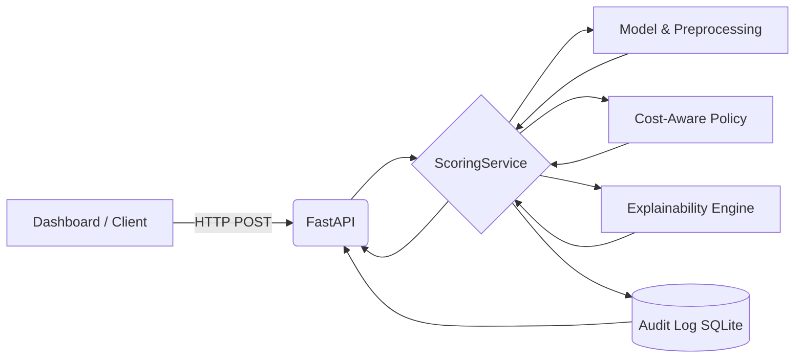

# Razorpay Return Risk Scorer

**AI-assisted return / chargeback risk decisioning for e-commerce orders**

> **IMPORTANT DISCLAIMER**
> This is a defense-only evaluation system trained on synthetic transaction data using hypothetical business-cost assumptions. It does **not** reflect real Razorpay production performance, nor does it contain real Razorpay transaction data or official cost thresholds. 

## Problem

E-commerce merchants face significant financial losses from returned orders (RTO - Return to Origin) and fraudulent chargebacks. 

Given an order at scoring time, this system estimates its return/chargeback risk and translates that mathematical signal into an operational action:
* **APPROVE**: Low risk; proceed without friction.
* **REVIEW**: Moderate risk; route to a human operations team for manual verification.
* **HOLD**: High risk; pause fulfillment pending escalated resolution.

The system is designed around risk ranking, operational review capacity, economic trade-offs, and transparent auditability. It does not autonomously block payments, but rather provides defense-in-depth decision support.

## Why this approach

This project emphasizes an evidence-driven, economically-aware ML methodology rather than raw model complexity:
* **Logistic Regression:** Transparent, inherently interpretable, and computationally efficient.
* **Calibration Evaluation:** Probabilities are evaluated for real-world calibration to ensure risk percentages are meaningful.
* **Cost-Aware Policy Selection:** Thresholds are mathematically optimized against simulated review costs and capacity constraints.
* **Bounded Decisions:** The model outputs an actionable `APPROVE / REVIEW / HOLD` decision, not just a floating-point number.
* **Model-Derived Explanations:** Real mathematical feature contributions (log-odds) are surfaced to assist human review.
* **Audit History:** An application-level append-only SQLite database ensures all decisions are durably recorded.

## Architecture



For deep technical details on component boundaries and data flows, see [ARCHITECTURE.md](ARCHITECTURE.md). For detailed model methodology, see [MODEL_CARD.md](MODEL_CARD.md).

## Quick Start

### Environment
```bash
python -m venv .venv
# Activate: source .venv/bin/activate (Linux/Mac) or .venv\Scripts\activate (Windows)
pip install -r requirements.txt
```

### Reproduce from scratch
```bash
python src/generate_data.py --n 5000 --seed 42
python src/policy_selection.py
python src/train.py
```

### Run the Application
**Backend (FastAPI):**
```bash
uvicorn api:app --app-dir src --host 127.0.0.1 --port 8000
```
**Frontend (Streamlit):**
```bash
streamlit run dashboard/app.py
```

### Tests
Run the comprehensive test suite to verify the decision engine, API, and policy isolation:
```bash
python -m unittest discover tests
```
*Current verified test count: 64 tests*

## Demo Walkthrough

A complete system evaluation takes approximately 2-3 minutes:
1. Open the Streamlit dashboard (`http://localhost:8501`).
2. Check the bottom-left sidebar to verify API Health is `READY`.
3. Enter a high-value COD order in the "Live Order Scoring" tab.
4. Click **Score Order**.
5. Observe the calculated Risk Score and the categorical **APPROVE/REVIEW/HOLD** decision.
6. Review the "Top Model Contributions" section to see exactly which features drove the risk up or down.
7. Copy the generated Audit ID.
8. Navigate to the **Recent Audited Decisions** tab.
9. Verify the decision was permanently recorded with its associated model and policy version.
10. Open the **Policy Analytics** tab to view the threshold trade-off curves.
11. View the **Held-Out Test Metrics** to see the system's simulated financial performance.

## Current Model and Evaluation

* **Model:** Logistic Regression
* **Model version:** `LR_UNWEIGHTED_V1`

### Final Held-Out Test Metrics
* **Test ROC-AUC:** 0.759
* **Test Average Precision:** 0.404

### Validation Diagnostics
* **Validation Brier Score:** 0.1218
* **Validation prevalence:** 0.1638
* **Validation naive Brier baseline:** 0.1369

*(Note: Brier Score is a validation diagnostic used during policy selection, not a held-out test metric).*

## Frozen Policy

The decision thresholds were optimized on an **internal validation split** to minimize simulated operational costs, preventing test-set leakage. The current hypothetical assumptions are:

* **Review threshold:** 0.20
* **Hold threshold:** 0.79
* **Review cost assumption:** ₹50
* **Hold cost assumption:** ₹150
* **Review residual-risk assumption:** 10%
* **Maximum intervention rate:** 25%
* **Maximum hold rate:** 5%

## Final Held-Out Policy Behavior

When the frozen policy is applied to the unseen synthetic test set under the stated assumptions, it yields:
* **Approval rate:** 71.9%
* **Review rate:** 28.1%
* **Hold rate:** 0.0%
* **Intervention precision:** 32.0%
* **Risk recall:** 54.2%
* **Estimated test cost:** ₹100,366.11

## Explainability

The system surfaces real mathematical explanations derived directly from the model weights using the formula:
`contribution_j = coefficient_j × transformed_feature_j`

These contributions are computed in Logistic Regression log-odds space. The explainability engine applies a **materiality threshold of 0.05** to filter statistical noise, handles categorical one-hot aggregation natively, and surfaces the **Top 3 Positive** and **Top 3 Negative** contributors. 
*Note: These are model-consistent mathematical explanations, not causal inferences.*

## Auditability

Every scored order is durably recorded in an application-level append-only SQLite database (`decision_audit.db`). The record includes a unique `audit_id`, UTC ISO-8601 timestamp, decision, risk score, reason codes, and strict `model_version` / `policy_version` tracking. *(Note: SQLite provides a functional hackathon MVP, but is not cryptographically tamper-proof).*

## API Endpoints

* `GET /health` — Diagnostics and readiness probe.
* `POST /score-order` — Synchronous scoring, threshold evaluation, and audit recording.
* `GET /audit/recent` — Retrieves a paginated list of recent historical decisions.
* `GET /audit/{audit_id}` - Retrieves a specific decision record from the application-level append-only audit trail.

## Limitations

* **Synthetic Data:** The dataset is artificially generated; relationships are stationary and lack real-world seasonal drift.
* **Hypothetical Costs:** Financial assumptions do not reflect actual Razorpay economics.
* **Storage MVP:** SQLite is a local file-based database and will experience locking issues under extreme high-throughput concurrent loads.
* **Security:** There is no authentication or authorization layer implemented in this MVP.
* **Idempotency:** Network retries will generate duplicate audit logs.
* **Calibration:** No secondary calibration layer is applied, though the native LR output remains reasonably calibrated.
* **Explanation Causality:** Features strongly correlated in the synthetic data may yield non-intuitive coefficient weights.
* **Unknown Categories:** Unknown categorical values are tolerated through `handle_unknown="ignore"`.

## Future Production Hardening

If escalated beyond MVP, realistic next steps include:
* Migrating to a production database or durable audit stream.
* Implementing authentication and authorization.
* Adding idempotency handling to the API layer.
* Implementing drift monitoring and an automated retraining strategy.
* Performing stronger calibration validation.
* Adding operational handling of unknown categories.
* Improving overall production observability.
